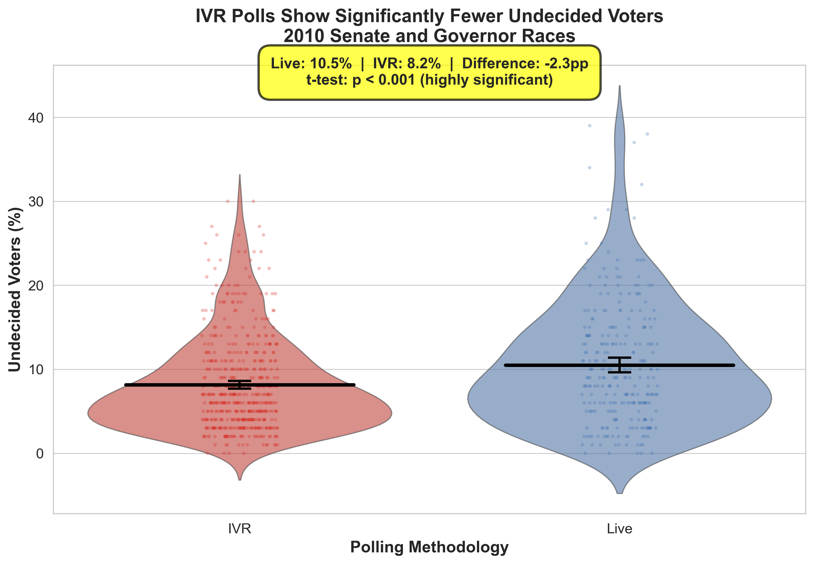
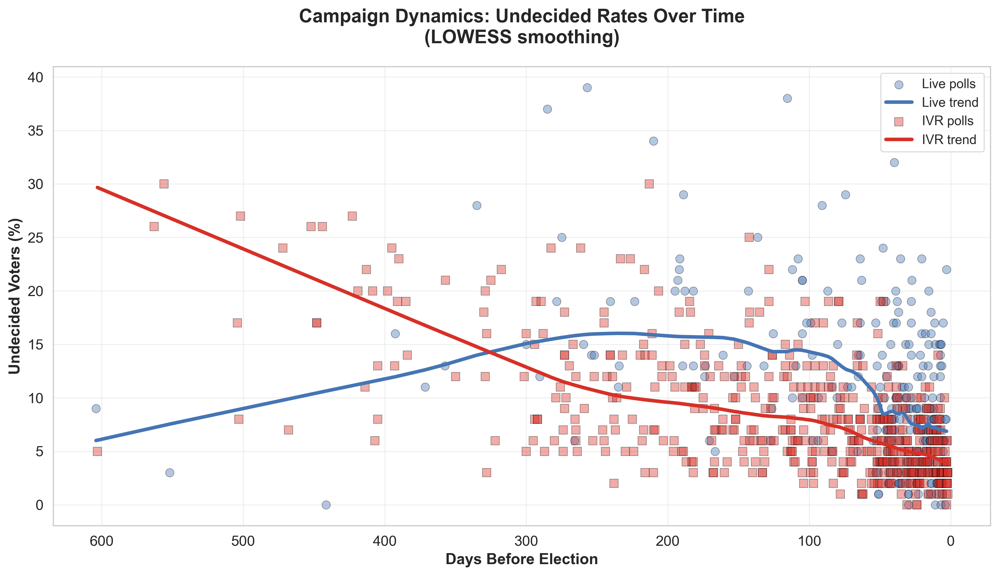
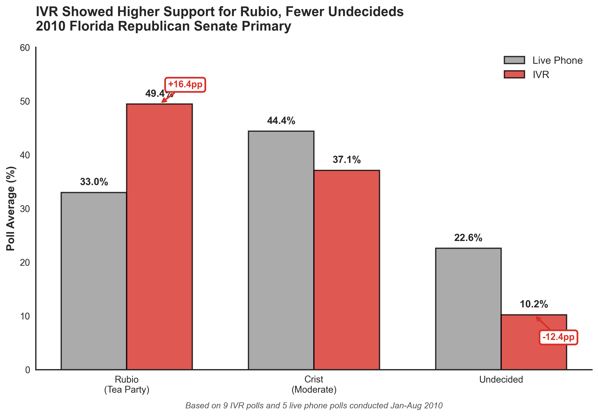

# Interactive Voice Response Polling in Election Campaigns
## Differences with Live Interview Surveys

**Master's Thesis (2014)**
**Author:** Alexander Brunk
**GitHub:** [@abrunk](https://github.com/abrunk)

**Original thesis:** [Virginia Tech Electronic Theses and Dissertations](https://vtechworks.lib.vt.edu/server/api/core/bitstreams/921ef60a-83ec-43f5-8a0c-8aabb1cbd85e/content)

---

## Abstract

Since the early 2000s, Interactive Voice Response (IVR) has become a widely popular method of conducting public opinion surveys in the United States. IVR surveys use an automated computer voice to ask survey questions and elicit responses in place of a live interviewer. Previous studies have shown that IVR polls conducted immediately before elections are generally accurate, but have raised questions as to their validity in other contexts.

This study examines whether IVR polls generate measurably different levels of candidate support when compared to live interviewer polls, as a result of non-response bias owing to lower response rates in IVR surveys. It did so by comparing polling in 2010 U.S. gubernatorial and U.S. Senate elections that was conducted using both live interviewers and IVR.

**The findings suggest that in general elections, IVR polls find fewer undecided voters compared to surveys conducted using live interviewers.** In primary elections, IVR polls can show larger support than live interview polls for a more ideologically extreme candidate who has high levels of support among more opinionated and engaged voters.

Implications are that journalists and other consumers of polling data should take into account whether a poll was conducted using IVR or live interviewers when interpreting results. IVR polls may tend to over-sample more engaged and opinionated voters, often resulting in smaller percentages of undecided respondents, and higher levels of support for specific candidates in certain contexts.

---

## Background and Literature Review

### The Rise of IVR Polling

Interactive Voice Response polls are conducted solely through the use of a computer system that reads an automated message to respondents on the phone, eliminating the need for live interviewers. Some of the most commonly cited polling organizations in the news, including Rasmussen Reports and SurveyUSA, use IVR to conduct their polls. Without the need to pay interviewers, IVR polls are much less expensive to conduct, lowering the barriers to entry for conducting them.

Between 2002 and 2010, the percentage of publicly reported election polls conducted using IVR more than doubled. By 2010, 41% of polls conducted in the twenty days leading up to Election Day were done exclusively using IVR (National Council on Public Polls 2011).

### IVR vs. Live Interview Methodological Differences

Research on IVR surveys outside of political polling has consistently found two main differences:

**1. Reduced Social Desirability Bias**
- IVR respondents are more willing to disclose sensitive information to an automated system than to a live interviewer
- Studies have shown IVR elicits more honest responses on topics like mental health, customer satisfaction, and personal behavior
- Without a live person on the line, respondents face less social pressure to give "acceptable" answers

**2. Lower Response Rates**
- IVR surveys consistently achieve lower response rates than live interviewer surveys
- Studies found IVR response rates of 24-29% compared to 38-49% for live interviews
- The decision to participate in an IVR survey appears to depend more on interest in the topic and self-confidence, rather than social factors like enjoying conversation with strangers

### Previous Research on IVR Polling Accuracy

Multiple studies have shown that IVR polls conducted **immediately before elections** are just as accurate at predicting election outcomes as live interviewer polls:

- AAPOR's 2009 study of 2008 presidential primaries found no measurable difference in accuracy between IVR and live interview polls
- National Council on Public Polls found that 77% of polls (both IVR and live) conducted after October 20, 2010 had results within the margin of error
- FiveThirtyEight analysis ranked IVR pollsters Survey USA and Rasmussen as 2nd and 3rd most accurate among 32 pollsters

**However**, this research focused exclusively on pre-election polls. It remained unclear whether IVR polls are equally valid when conducted weeks or months before an election.

### The Delaware Study (Van Lohuizen 2010)

The most direct evidence for IVR/live interview differences came from an experimental study in the 2010 Delaware Republican Senate primary. Jan Van Lohuizen conducted two identical polls approximately one week before the primary—one using live interviewers, one using IVR:

**Results:**
- **IVR poll:** O'Donnell +14 (53% to 39%)
- **Live poll:** Castle +23 (56% to 33%)
- **Election outcome:** O'Donnell +6 (53% to 47%)

**Sample composition differences:**
- IVR respondents: 53% "very conservative," 19% moderate/liberal
- Live respondents: 40% "very conservative," 32% moderate/liberal
- Response rates: IVR 9%, Live 23%

Van Lohuizen concluded: "it may very well be that the type of person who is more likely to respond to a robo-poll has a stronger desire to be heard, is less likely to be undecided, and is more likely to express an opinion."

### Blumenthal's 2006 Analysis

Mark Blumenthal and Charles Franklin's 2007 conference paper "Methods and Horse Races: Phone, IVR and Internet Polls in the 2006 Elections" found that in 2006 statewide election polls, **IVR surveys tended to have fewer undecided voters than live interviewers in the same month**.

This finding provided initial evidence that the differences observed in Delaware might be systematic rather than isolated.

### Research Gap

Despite extensive research showing IVR accuracy in pre-election polls, no comprehensive study had examined whether IVR and live interview polls produce systematically different results **earlier in campaigns**—when voters are less engaged and fewer have formed opinions.

---

## Research Questions and Hypotheses

Based on the literature showing that:
1. IVR surveys have lower response rates
2. Voters more difficult to contact tend to be less engaged and informed
3. The Delaware study showed IVR over-sampling highly engaged conservatives

**This thesis tests two hypotheses:**

**H1:** Interactive Voice Response poll samples contain more engaged and opinionated voters, resulting in **fewer undecided voters** when compared with live interviewer polls conducted approximately the same length of time prior to an election.

**H2:** In situations where a specific candidate tends to receive more support among highly engaged and opinionated voters (such as an ideologically-charged primary election), Interactive Voice Response polls will show **significantly greater support for that candidate** when compared to live interviewer polls.

---

## Data and Methodology

### Data Collection

**Sample:** 805 polls from 2010 U.S. Senate and Gubernatorial elections
- 37 Senate races
- 37 Gubernatorial races
- Polls conducted from January through October 2010

**Sources:**
- RealClearPolitics polling aggregator
- Pollster.com (now HuffPost Pollster)
- Individual pollster websites

**Inclusion criteria:**
- Conducted using IVR or live interviewers (not online or other methods)
- Surveys of likely voters or registered voters
- Polls from firms not accused of fraud (excluded Strategic Vision and Research 2000)

**Final dataset:**
- September: 167 IVR polls, 125 live interview polls
- October: 268 IVR polls, 252 live interview polls

### Variables

**Dependent Variable:**
- Undecided voter percentage (calculated as 100% minus all candidates' support)
- "Modified undecided" value: Y_u = 1 - Y_1 - Y_2 ... - Y_C

**Independent Variables:**
- **X₁:** Survey methodology (IVR = 1, Live = 0)
- **X₂:** Days before election (using midpoint of field period)

### Statistical Model

**Weighted Least Squares (WLS) Regression:**

```
Y = α + β₁X₁ + β₂X₂ + ε
```

Where:
- Y = proportion of undecided voters (or candidate support)
- X₁ = IVR (1) vs. Live (0)
- X₂ = days before election
- Weights = 1 / √(0.25/N)

**Why WLS instead of OLS?**
- Polls have varying sample sizes, creating heteroscedasticity
- Larger samples have less variance and should be weighted more heavily
- WLS "tries harder" to match observations where weights are large

**Weight calculation:**
Using the inverse of the standard error for a proportion:

w = 1 / √(pq/N)

For general elections (where some undecided rates = 0), used maximum standard error:

w = 1 / √(0.25/N)

---

## Main Findings

### General Elections: Undecided Voters by Month

Averaging all polls by month showed consistent differences:

| Month | IVR Average | Live Average | Difference |
|-------|------------|--------------|------------|
| **September** | **6.2%** undecided | **9.6%** undecided | **-3.4pp** |
| **October** | **4.7%** undecided | **8.0%** undecided | **-3.3pp** |



### Regression Results

**Weighted Least Squares regression controlling for timing:**

The IVR effect on undecided voters was **statistically significant and negative** across all specifications.


**Key findings:**
- IVR methodology consistently associated with 2-4 percentage points fewer undecided voters
- Effect remained significant after controlling for days before election
- Pattern held across both Senate and Gubernatorial races

### Temporal Dynamics



Undecided voters decline as Election Day approaches in **both** methodologies, but IVR consistently shows fewer undecideds throughout the campaign period.

---

## Primary Elections Analysis

For four 2010 primary elections with sufficient data, the thesis tested whether IVR showed greater support for ideologically extreme candidates.

### Florida Republican Senate Primary: Rubio vs. Crist

The most striking evidence came from the Florida Republican Senate primary, where Marco Rubio (Tea Party-backed conservative) faced Charlie Crist (moderate establishment incumbent):



**IVR vs. Live Phone Polling Averages:**
- **Rubio (Tea Party):** IVR 49.4%, Live 33.0% (**+16.4pp** difference)
- **Crist (Moderate):** IVR 37.1%, Live 44.4% (**-7.3pp** difference)
- **Undecided:** IVR 10.2%, Live 22.6% (**-12.4pp** difference)

*Based on 9 IVR polls and 5 live phone polls conducted January-August 2010*

This pattern supports H2: IVR polls over-sampled highly engaged conservative Republican primary voters who strongly preferred Rubio. The massive 12.4pp difference in undecided rates also confirms H1 even in the primary context.

### Other Primaries

**California Republican Gubernatorial Primary:** No significant IVR effect
**California Republican Senate Primary:** Mixed results
**Pennsylvania Democratic Senate Primary:** Some evidence for IVR advantage for Sestak (insurgent)

The primary results were less conclusive than the general election findings for California and Pennsylvania, likely due to smaller sample sizes and the complexity of multiple candidates. However, the Florida primary provided strong supporting evidence for the hypothesis.

---

## Discussion and Implications

### Why Does IVR Show Fewer Undecideds?

The most likely explanation is **non-response bias combined with differential selection**:

1. **Lower response rates** (9% for IVR vs. 23% for live in Delaware study)
2. **Self-selection of engaged voters** - people who complete IVR surveys appear to be more politically interested and opinionated
3. **No social motivation** - without a live person, only topic interest and self-confidence drive participation
4. **Measurement artifact** - IVR requires explicit keypress for "undecided," whereas live interviewers may code hesitation as uncertainty

This is **not** primarily about social desirability bias. If voters were simply more honest with IVR, we would expect IVR to be consistently more accurate. Instead, both methods are equally accurate immediately before elections (when nearly all voters are engaged), but differ earlier in campaigns.

### Implications for Poll Consumers

**1. Aggregation introduces bias**
- Poll aggregators like RealClearPolitics mix IVR and live polls without methodology adjustments
- If IVR dominates the sample, aggregate undecided rates will be artificially low
- This affects interpretations of race volatility and late-breaking potential

**2. Comparability over time**
- Comparing "undecided voter trends" only meaningful if methodology composition stays constant
- A decline from 12% to 8% undecided could reflect genuine opinion formation OR a shift from live to IVR polls

**3. Context matters for interpretation**
- An IVR poll showing 5% undecided may represent similar uncertainty as a live poll showing 8% undecided
- Consumers should check methodology before comparing polls

### Implications for Pollsters

**1. Methodology choice is not neutral**
- The 3-4pp undecided effect is larger than many polls' stated margin of error
- Cost savings from IVR come with substantive measurement differences

**2. Transparency is essential**
- Pollsters should prominently report methodology (many hide it in fine print)
- Disclosure of how undecideds are allocated to candidates is critical

**3. Coverage limitations** (as of 2010)
- IVR legally cannot call cell phones
- By 2010, 25% of U.S. households were cell-only (growing rapidly)
- This coverage gap likely compounds the engagement bias

---

## Limitations

1. **Observational design:** Cannot definitively establish causal mechanisms—only association between IVR and lower undecided rates

2. **Unmeasured methodological differences:** Likely voter models, sampling frames (RDD vs. RBS), weighting procedures vary by pollster and are not always disclosed

3. **Single election cycle:** Analysis limited to 2010; patterns may vary across different political environments

4. **No ground truth for early polls:** Unlike pre-election polls, cannot validate against actual outcomes to determine which methodology is "correct"

5. **Limited primary analysis:** Smaller sample sizes in primaries made H2 testing less conclusive

---

## Files in This Repository

### Visualizations (Modern Seaborn/Matplotlib)

- `figures/thesis_fig1_main_finding.png` - Main finding: IVR shows 2.3pp fewer undecided voters
- `figures/thesis_fig2_temporal.png` - Temporal pattern: IVR consistently lower through campaign
- `figures/thesis_fig3_distribution.png` - Distribution comparison showing IVR clustering
- `figures/thesis_fig4_florida_primary.png` - Florida primary: Rubio vs. Crist IVR/live differences

### Code

- `R/create_thesis_visualizations.py` - Publication-quality visualizations using seaborn
  - Implements Cole Knaflic visualization principles
  - 300 DPI resolution for publication
  - Clean, focused designs that tell a clear story

### Original Thesis

- **Full thesis PDF:** [Virginia Tech](https://vtechworks.lib.vt.edu/server/api/core/bitstreams/921ef60a-83ec-43f5-8a0c-8aabb1cbd85e/content)
- **Original data repository:** [thesis_ivr_polling](https://github.com/abrunk/thesis_ivr_polling)

---

## Reproducibility

### Requirements
```bash
pip install pandas numpy matplotlib seaborn scipy statsmodels
```

### Generate Visualizations
```bash
python R/create_thesis_visualizations.py
```

All figures saved to `figures/` directory.

---

## Citation

```bibtex
@mastersthesis{brunk2014ivr,
  author  = {Brunk, Alexander Crowley},
  title   = {Interactive Voice Response Polling in Election Campaigns: Differences with Live Interview Surveys},
  school  = {Virginia Polytechnic Institute and State University},
  year    = {2014},
  type    = {Master's Thesis},
  url     = {https://vtechworks.lib.vt.edu/handle/10919/64483}
}
```

---

## License

**Thesis text:** © 2014 Alexander Brunk. All rights reserved.
**Code:** MIT License
**Data:** Collected from public sources

---

## Contact

**Alexander Brunk**
GitHub: [@abrunk](https://github.com/abrunk)

---

*Original thesis completed: December 2014*
*Modern visualizations created: February 2026*
