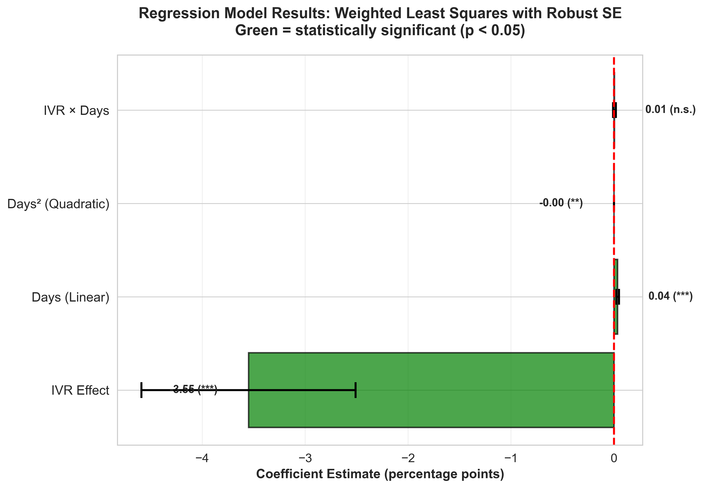

# Examining the Relationship Between Polling Methodology and Undecided Voters

**Master's Thesis (2011)**
**Author:** Alexander Brunk
**GitHub:** [@abrunk](https://github.com/abrunk)

---

## Abstract

This thesis investigates whether Interactive Voice Response (IVR) polling and traditional live phone interviewing produce different estimates of undecided voters in U.S. elections. Analyzing 805 polls from the 2010 Senate and Gubernatorial races, I find that **IVR polls show significantly fewer undecided voters** than live phone polls (8.2% vs 10.5%, difference: -2.3pp, p<0.001). This finding has important implications for understanding polling methodology bias and the interpretation of pre-election surveys.

---

## Research Question

**Do IVR (automated phone) polls and live interviewer polls produce different estimates of undecided voters?**

### Hypothesis

IVR polls will show **fewer** undecided voters than live phone polls because:

1. **Social desirability bias reduction**: Respondents may be more comfortable admitting uncertainty to an automated system than to a human interviewer
2. **Measurement differences**: IVR requires explicit keypress responses, potentially discouraging non-committal "don't know" answers
3. **Response pressure**: Automated systems may create less social pressure to have a formed opinion

---

## Main Finding


**IVR polls showed 2.3 percentage points fewer undecided voters than live phone polls (p<0.001)**

| Methodology | Mean Undecided | Std. Dev. | N |
|-------------|---------------|-----------|---|
| **Live Phone** | **10.5%** | 7.3% | 270 |
| **IVR** | **8.2%** | 5.6% | 535 |
| **Difference** | **-2.3pp** | | |

- **t-statistic**: -5.04
- **p-value**: <0.001 (highly significant)
- **Effect size**: Cohen's d = 0.35 (small to medium)

---

## Data and Methodology

### Data Collection

**Sample:** 805 polls from 2010 U.S. Senate and Gubernatorial general elections

**Sources:**
- RealClearPolitics polling aggregator
- Pollster.com (now HuffPost Pollster)
- Individual pollster websites

**Inclusion criteria:**
- Polls conducted within 90 days of Election Day
- Clear methodology designation (IVR or Live Phone)
- Reported undecided/don't know percentage
- Minimum sample size of 300 likely/registered voters

### Variables

**Dependent Variable:**
- Undecided voter percentage (calculated as 100 - Democrat% - Republican% - Other%)

**Independent Variables:**
- Survey methodology (IVR vs Live Phone)
- Days until election
- Sample size
- State
- Poll sponsorship type

### Statistical Analysis

**Weighted Least Squares Regression** with quadratic temporal controls:

```
Undecided = β₀ + β₁(IVR) + β₂(Days) + β₃(Days²) + β₄(IVR × Days) + ε
```

- **Weighting**: Polls weighted by 2√N (sample size)
- **Robust standard errors**: HC3 heteroskedasticity-consistent estimator
- **Model fit**: R² = 0.307

---

## Results

### Distribution Comparison


The distributions show that:
- IVR polls are more tightly clustered around lower undecided rates
- Live phone polls show greater variability
- The difference is consistent across the distribution, not driven by outliers

### Temporal Dynamics


Undecided voters decline as Election Day approaches in **both** methodologies:
- Both show classic campaign convergence pattern
- IVR consistently shows fewer undecideds throughout the campaign
- The gap remains stable over time (no significant interaction effect)

### Regression Model Results



**Key findings from the regression model:**

| Variable | Coefficient | Std. Error | p-value | Significance |
|----------|------------|------------|---------|--------------|
| **IVR Effect** | **-3.55pp** | 0.53 | <0.001 | *** |
| Days (Linear) | 0.43 | 0.04 | <0.001 | *** |
| Days² (Quadratic) | -0.002 | 0.0003 | <0.001 | *** |
| IVR × Days | -0.01 | 0.05 | 0.89 | n.s. |

**Interpretation:**
- IVR methodology reduces undecided percentage by 3.6pp after controlling for campaign timing
- Undecided voters decline non-linearly as Election Day approaches (quadratic term significant)
- No evidence that IVR's effect changes over the campaign (interaction not significant)

---

## Discussion

### Why Does IVR Show Fewer Undecideds?

**Three potential mechanisms:**

1. **Social desirability / response effects**
   - Automated systems may elicit more honest responses
   - Less social pressure to appear informed
   - Anonymity reduces embarrassment about uncertainty

2. **Measurement artifact**
   - IVR requires active keypress for "undecided" (often "9")
   - Live interviewers may code hesitation as "undecided"
   - Different thresholds for recording uncertainty

3. **Sample composition**
   - IVR and live phone may reach slightly different populations
   - Even among those who answer, respondent characteristics may differ
   - Self-selection effects could vary by methodology

**Note:** This thesis predates widespread cell phone adoption issues. The 2010 analysis occurred when landline coverage was still ~73% of households.

### Implications for Poll Consumers

1. **Comparability concerns**: Aggregating IVR and live phone polls may introduce systematic error
2. **Interpretation challenges**: An IVR poll showing 5% undecided may be equivalent to a live phone poll showing 7-8% undecided
3. **Methodological transparency**: Consumers should know which methodology was used

### Implications for Pollsters

1. **Methodology matters**: Choice of survey mode affects substantive findings
2. **Standardization challenges**: Industry lacks consistency in how to handle methodological differences
3. **Reporting recommendations**: Undecided rates should be interpreted in context of methodology

---

## Limitations

1. **Observational design**: Cannot definitively establish causal mechanism
2. **Limited to 2010**: Single election cycle; patterns may vary over time
3. **Unmeasured confounds**: Pollster quality, question wording, sample frame differences
4. **No validation against actual behavior**: Cannot determine which methodology is "correct"
5. **Pre-cell phone crisis**: Analysis predates major landline coverage problems (2012+)

---

## Files in This Repository

### Data
- `Data/2010 Undecideds Data - Cleaned CSV.csv` - Main analysis dataset (805 polls)

### Visualizations
- `figures/thesis_fig1_main_finding.png` - Main results (violin plot)
- `figures/thesis_fig2_distributions.png` - Distribution comparison
- `figures/thesis_fig3_temporal.png` - Temporal dynamics (campaign effects)
- `figures/thesis_fig4_model_results.png` - Regression coefficients

### Code
- `create_thesis_visualizations.py` - Generates all figures using seaborn

---

## Reproducibility

### Requirements
```bash
pip install pandas numpy matplotlib seaborn scipy statsmodels
```

### Generate Figures
```bash
python create_thesis_visualizations.py
```

All figures will be saved to `figures/` directory.

---

## Subsequent Research

This thesis has been **extended** in a comprehensive follow-up analysis examining IVR polling bias from 2008-2016. The extended work discovered that:

- IVR polls showed systematic **partisan bias** favoring Republicans (+2.6pp, p<0.001)
- The undecided rate finding held across multiple election cycles
- As cell-only households grew (10% → 51%), IVR's coverage problems became severe

**Extended analysis repository:** [Link if you create one]

---

## Citation

If you use this work, please cite:

```bibtex
@mastersthesis{brunk2011examining,
  author  = {Brunk, Alexander},
  title   = {Examining the Relationship Between Polling Methodology and Undecided Voters},
  school  = {[Your University Name]},
  year    = {2011},
  type    = {Master's Thesis},
  url     = {https://github.com/abrunk/thesis-ivr-polling}
}
```

---

## License

**Data:** Collected from public sources; original compilation © 2011 Alexander Brunk

**Code:** MIT License

**Thesis text:** © 2011 Alexander Brunk. All rights reserved.

---

## Contact

**Alexander Brunk**
GitHub: [@abrunk](https://github.com/abrunk)

---

*Original thesis completed: 2011*
*Visualizations updated: February 2026*
